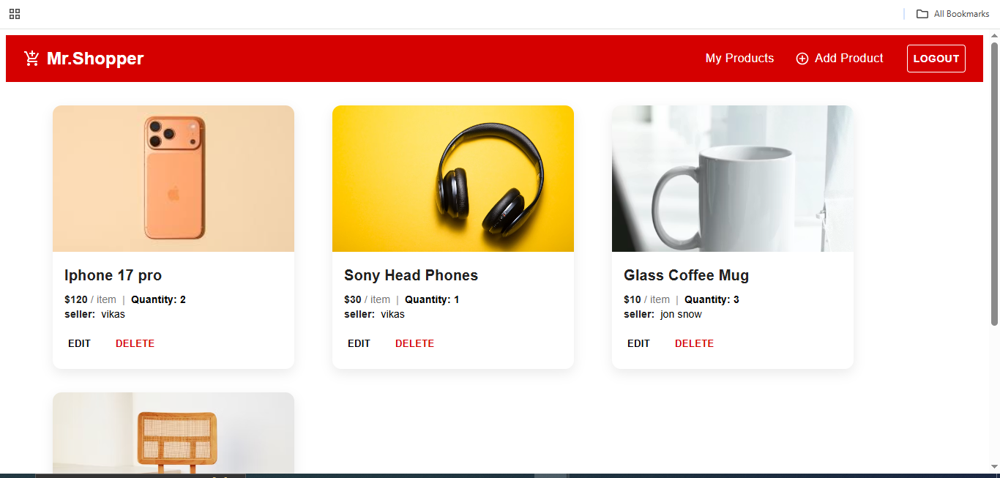

# 🛒 MrShopper – Full Stack Product Management

MrShopper is a modern, full-stack product management platform built using **React (Vite)** and **Node.js + Express**.

It enables users to list products for sale, edit details, delete items, and view a global feed of products from all sellers. The app features robust authentication, real-time UI updates, and a responsive storefront design.

---


## 🌐 Live Demo
**🔗 Public URL:** https://mrshopper.vercel.app/
## 🎥 Demo & Explanation Video
[Demo Video!](https://drive.google.com/file/d/1iQXcXTXQAyRkeDGis-NinB25E_IxOPwq/view?usp=sharing)  

## ✨ Highlights

- ⚡ **Optimistic UI & Real-time Updates**
- 🔐 **JWT Authentication** (Login/Register)
- 🔄 **React Query** for server state management
- 📡 **REST API** with Express
- 🍃 **MongoDB + Mongoose**
- 🎨 **Material UI (MUI)** for styling

---

## 🧱 Tech Stack

### Frontend

- React (Vite)
- Material UI (MUI) – Component library
- TanStack Query (React Query) – Data fetching & caching
- React Router DOM – Routing & navigation
- React Hot Toast – Toast notifications
- Axios – HTTP client

### Backend

- Node.js
- Express.js
- MongoDB + Mongoose – Database & modeling
- JWT (JSON Web Tokens) – Authentication
- Bcrypt – Password hashing
- CORS – Cross-Origin Resource Sharing

---

## ✨ Features

### 🔐 Authentication

- Secure **Sign Up & Login** using JWT-based session management.
- **Protected routes** – Only authenticated users can add, edit, or delete products.

### 🛍️ Product Management (CRUD)

- **Create**  
  Users can add products with:
  - Name  
  - Price  
  - Quantity  
  - Image URL  
  - Description  

- **Read**
  - **Global Feed** – View all products from every seller in a storefront-style grid.
  - **My Products** – Filtered view showing only items created by the logged-in user.

- **Update**  
  Edit product details with a **pre-filled form**.

- **Delete**  
  Remove products with a custom **“Confirm Delete” toast UI**.

### 🛡️ Authorization & Security

- **Ownership check** – Users can **only edit or delete their own products**.
- **Visual feedback** – Toast notifications for:
  - Success
  - Errors
  - Unauthorized actions

---

## 📂 Project Structure

```bash
mrshopper-root/
├── backend/                # Express API & Auth logic
│   ├── src/
│   │   ├── models/         # Mongoose Schemas (User, Product)
│   │   ├── routes/         # API endpoints (auth.route, product.route)
│   │   ├── controllers/    # Logic for Auth and Product CRUD
│   │   ├── middleware/     # Auth protection middleware
│   │   └── lib/            # DB connection & utils
│   └── app.js           # Server entry point
│
├── frontend/               # React Vite frontend
│   ├── src/
│   │   ├── components/     # UI components (Navbar, ProductCard, etc.)
│   │   ├── pages/          # Home, Feed, Login, Add/Edit Product
│   │   ├── lib/            # Axios instance & API functions
│   │   └── hooks/          # Custom Auth hooks
│   └── package.json
│
└── package.json            # Root config
```

---

## 🚀 How to Run Locally

Follow these steps to get the project running on your machine.

### 1️⃣ Clone the Repository

```bash
git clone https://github.com/21R11A0426/MrShopper.git
cd MrShopper
```

### 2️⃣ Backend Setup

Navigate to the backend folder and install dependencies:

```bash
cd backend
npm install
```

Create environment variables:

Create a file named **`.env`** inside the `/backend` folder and add:

```env
PORT=8080
MONGO_URI=your_mongodb_connection_string
JWT_SECRET=your_super_secret_key
NODE_ENV=development
```

> 💡 You can use a local MongoDB URL like  
> `mongodb://localhost:27017/mrshopper`  
> or a MongoDB Atlas connection string.

Start the backend server:

```bash
npm start
```

You should see:

- `Server running on port 5000`
- `MongoDB connected`

### 3️⃣ Frontend Setup

Open a **new terminal window** (keep the backend running), then:

```bash
cd frontend
npm install
```

Create environment variables:

Create a file named **`.env`** inside the `/frontend` folder and add:

```env
VITE_API_BASE_URL=http://localhost:8080/
```

Start the frontend application:

```bash
npm run dev
```

The app will run at: **http://localhost:5173**

---

## 🧪 API Endpoints

### 🔐 Auth

- `POST /register` – Register a new user  
- `POST /login` – Login user & receive JWT  
- `POST /logout` – Clear session  

### 🛍️ Products

- `GET /` – Fetch all products (Global Feed)  
- `GET /:id` – Fetch single product details  
- `POST /` – Create a new product (**Auth required**)  
- `PUT /:id` – Update a product (**Auth + Ownership required**)  
- `DELETE /:id` – Delete a product (**Auth + Ownership required**)  

---

## 👤 Author

**Vikas Maldanngari**

- 🐙 GitHub: [github](https://github.com/21R11A0426)  
- 💼 LinkedIn: [Linkedin](https://www.linkedin.com/in/maldannagari-vikas/)  
- 🌐 Portfolio: [portfolio](https://vikas-portfolio-teal.vercel.app/)

---

If you like this project, consider ⭐ starring the repo on GitHub!
